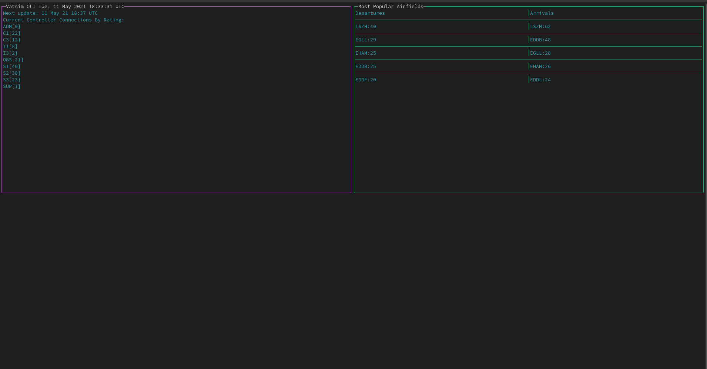

# Vatsim CLI
This is a simple statistics application based on the Vatsim networks JSON data file.

Purely an experiment and learning app for me while I am learning Go in more depth.

## Information
- **Departures** - These are not limited to departures on the ground but also departures en-route to their arrival.
- **Arrivals** - These do not take into account pre-filed flight plans that are upcoming.

## Planned Improvements
- **Pre-files** - Add support to include pre-filed flight plans, as such if a connection is not active with a flight plan on the ground, it will be ignored until such a time this is true.
- **En-Routes** - Plans to add toggleable filter options to include en-routes to be included in counts

## Screenshots
